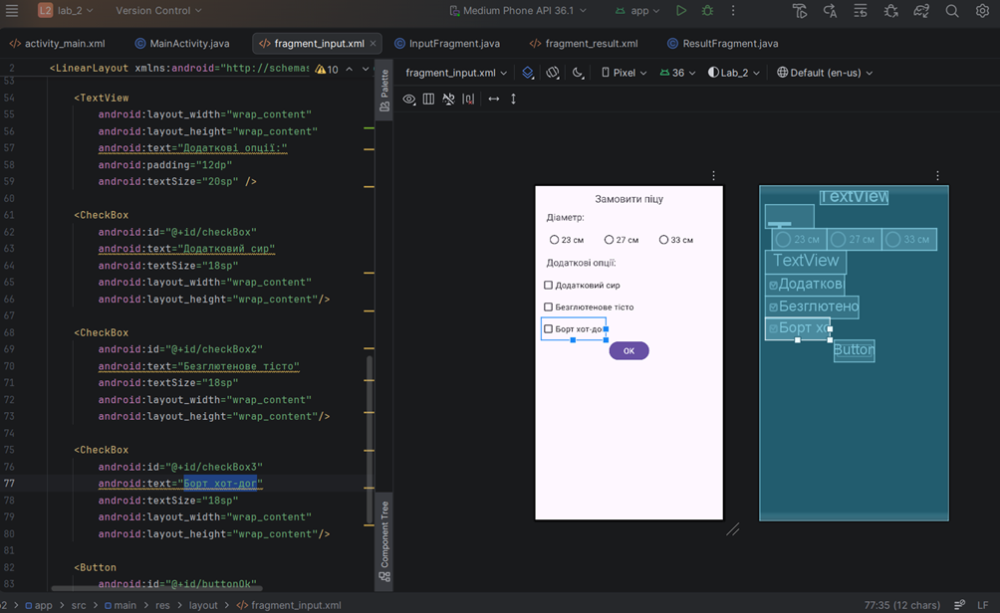
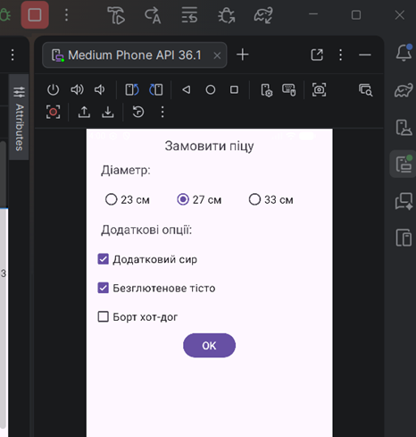
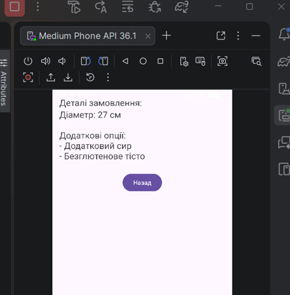

## Лабораторна робота №2 

### Тема: дослідження роботи з компонентом fragment.

У створеному проекті за шаблоном Empty Views Activity додано два фрагменти: InputFragment (для форми введення даних (RadioGroup, CheckBox, Button “OK”), ResultFragment (для текстового поля для відображення результату та кнопку “Back”, яка повертає користувача до InputFragment.).
Обидва фрагменти працюють у межах однієї Activity.

У MainActivity реалізовано інтерфейси взаємодії: InputFragment.OnInputListener для передачі даних до ResultFragment і ResultFragment.OnCancelListener для повернення на InputFragment.

activity_main.xml залишено створений за замовчуванням без змін за виключенням видалення шаблонного  “Hello world”.

У InputFragment (файли InputFragment.java і fragment_input.xml) реалізовано форму для введення даних користувачем. Фрагмент містить формму для отримання даних від користувача, як і в попередній лабораторній роботі: TextView для заголовка та пояснення, RadioGroup з трьома RadioButton для вибору одного варіанту діаметра піци, три CheckBox для вибору додаткових опцій, Button “OK” для підтвердження вибору.

При натисканні на кнопку “OK” фрагмент перевіряє, чи обраний хоча б один RadioButton. Якщо ні – користувачу відображається спливаюче повідомлення (Toast) з проханням завершити введення даних. Якщо дані введені коректно, InputFragment формує текст результату на основі обраних опцій та передає його до MainActivity через інтерфейс OnInputListener, що забезпечує взаємодію між фрагментами.
 

У ResultFragment (файли InputFragment.java і fragment_result.xml) реалізовано відображення результату взаємодії користувача. Фрагмент містить TextView, у який передається та відображається сформований InputFragment текст, Button “На попередню”, який при натисканні викликає метод інтерфейсу OnCancelListener, реалізований у MainActivity. Після натискання “На попередню” ResultFragment видаляється, а у фрагментному контейнері знову відображається InputFragment.

Після запуску програма коректно відпрацьовує: 
Спершу бачимо InputFragment, де обираємо потрібні опції: 
 

При натисканні на кнопку ОК відображається ResultFragment з текстом, що відповідає обраним опціям: 
 

### Висновок:
Під час виконання лабораторної роботи застосовано на практиці отримані щнання про роботу компонента Fragment у Android. Реалізовано взаємодію між фрагментами через інтерфейси, вивчено методи передачі даних між фрагментами (Bundle та newInstance), освоєно динамічне керування фрагментами через FragmentManager.
